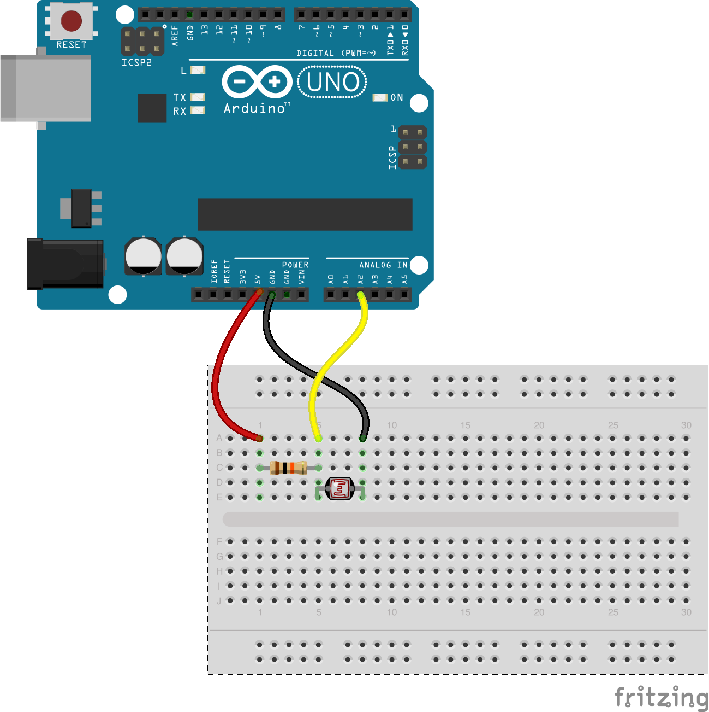
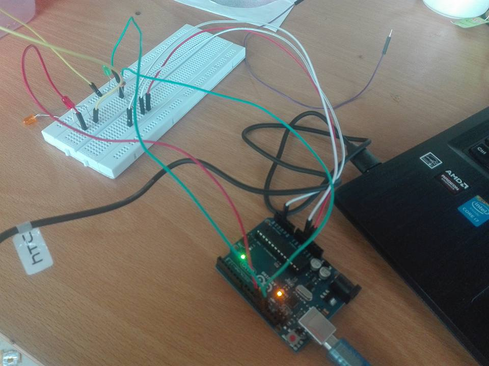

# ldr-tweet
Sends a tweet if it's too dark or lit on the given credentials using photoresistor. Green and red leds are also there to signify the final status of the tweet.   

## Circuit Board

### Components

Following are the required components for this project.

- Breadboard
- Male to Male Jumper Wires
- Arduino UNO/Genuino
- Photoresistor
- 1k Resistor
- Button

The schematic diagram of the circuit is as follows.



## Setting up the project

After cloning this repository run `npm install` in the root of the directory to install the required packages.  

In order to run this project, you need to have the twitter keys first. Go to [apps.twitter.com](https://apps.twitter.com), follow the procedure to create the new app. 

Create a `keys.js` in the root directory, copy and paste the following code 
var ENV = process.env

```js
ENV["TWITTER_CONSUMER_KEY"] = ""
ENV["TWITTER_CONSUMER_SECRET"] = ""
ENV["TWITTER_ACCESS_TOKEN_KEY"] = ""
ENV["TWITTER_ACCESS_TOKEN_SECRET"] = ""
``` 

Replace the empty strings with your values. 

Now type `node index.js` to run the project. Try to light up the ldr or make it too dark and enjoy the tweets being sent from your account. 

#### Sample setup



### LICENSE
MIT LICENSE. See [LICENSE](LICENSE) for more details.